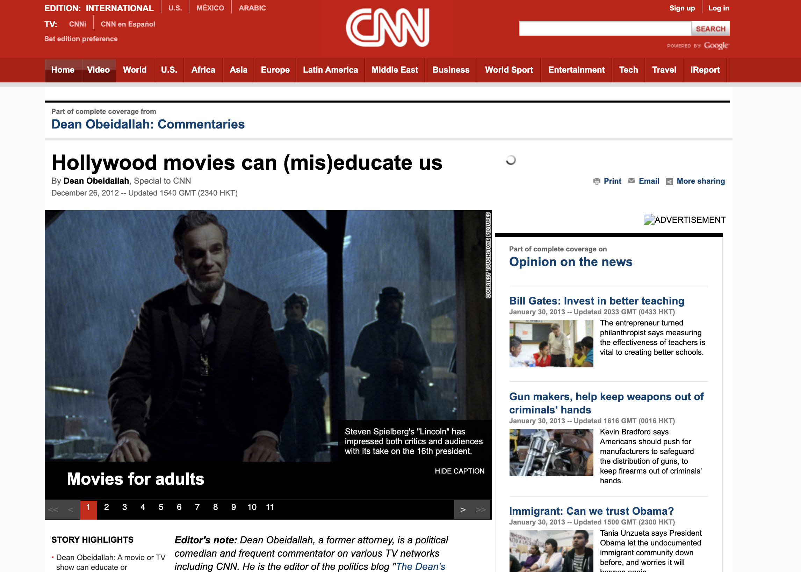

# Thinkful Data Science Final Capstone
## NLP Topic Modeling of CNN Web Articles via LDA

As a former English teacher in Japan, providing my students with relevant material that was both useful for their learning and classroom engagement was of utmost importance. I often found my most successful lessons were the ones where we discussed current affairs in the news, as these were topics they were already discussing among themselves in Japanese. More importantly, due to the nature of most of these lessons, they often allowed me to teach more than just vocabulary and grammar, by instilling my students with critical thinking skills and offering them an avenue to express their own ideas on worldly problems. That is why I used to offer two different level elective English courses that were focused solely on current affairs in the world and they relied heavily on news articles as source material for discussions. 

A big inherent problem with this style of class, as hinted above, is that there is no readily available textbook to teach current news and the responsibility of building a proper curriculum rests solely on the teacher. The challenge in planning for such a class, short of predicting the news, is balancing student exposure to an assortment of topics that can properly expand their lexicon, while keeping in mind new topics take more time to digest and recurring topics have limited opportunities to learn new terms and ideas. Additionally, students have different interests from each other. Some enjoyed recent topics on scientific discoveries, some wanted to discuss world politics, while others, sadly the majority, wanted to discuss the latest scandals in the Korean pop world. As a teacher, it was important to recognize the potential learning experience each topic has to offer and which subjects offer the most in terms of an overall learning experience.

But even with this in mind, it was hard to build a curriculum that could offer a diverse enough material throughout the year because it is impossible to predict the news. It seemed that each year we would finish discussing a particular topic, only to have the next big news story be something similar and feeling obligated to go over it, thus delaying or scrapping other lessons because of it. Some semesters last year felt more like a political science class than an English class and I could tell from the look in my students’ eyes that they were tired of it. And I know I was not alone when dealing with these issues as almost all of my old colleagues have expressed similar concerns in teaching current affairs classes as well. So, there must be a better way, right?

This is why, the question I propose for this project is:	
**Can we utilize natural language processing (NLP) methodology on news articles, namely topic modeling, to ensure students get exposure to a range of relevant topics in current news?**

Namely, can we look at historic news article data, extract key recurring topics with NLP, and use these topics to better build balanced curricula for courses that depend on teaching students in current affairs? Furthermore, can these same NLP methods procure a vocabulary list of key terms for said topics that can expedite the steep learning curve of learning unfamiliar topics?

## Step 1: Extracting Data

This project will explore the [CNN stories dataset](https://cs.nyu.edu/~kcho/DMQA/), originally used by DeepMind, that contains over 90,000 CNN web articles, and their respective HTML files, from April 2007 to April 2015. The data is semi-cleaned in that the main article and a brief summary has been extracted already from the HTML files into individual text files. However, for this project I want to extract the publish date for each article from the HTML files as well in order to plot a topic timeline that might provide insight on when certain topics are mostly likely to appear in the news. Furthermore, while the dataset includes a summary for each article, this data will only be used to verify the validity of the summaries generated from the model, especially since their origins are unknown. 

## Step 2: Preprocessing

- [x]  Cleaning the text
- [x]  Parsing
- [x]  Lemmatizing
- [x]  Rejoining all tokens to articles 

## Step 3: Vectorization and Modeling

## Conclusion

