# Thinkful Data Science Final Capstone
## NLP Topic Modeling of CNN Web Articles via LDA
**Barrett Nibling**

*https://www.linkedin.com/in/barrettnibling/*

As a former English teacher in Japan, providing my students with relevant material that was both useful for their learning and classroom engagement was of utmost importance. I often found my most successful lessons were the ones where we discussed current affairs in the news, as these were topics they were already discussing among themselves in Japanese. More importantly, due to the nature of most of these lessons, they often allowed me to teach more than just vocabulary and grammar, by instilling my students with critical thinking skills and offering them an avenue to express their own ideas on worldly problems. That is why I used to offer two different level elective English courses that were focused solely on current affairs in the world and they relied heavily on news articles as source material for discussions. 

A big inherent problem with this style of class, as hinted above, is that there is no readily available textbook to teach current news and the responsibility of building a proper curriculum rests solely on the teacher. The challenge in planning for such a class, short of predicting the news, is balancing student exposure to an assortment of topics that can properly expand their lexicon, while keeping in mind new topics take more time to digest and recurring topics have limited opportunities to learn new terms and ideas. Additionally, students have different interests from each other. Some enjoyed recent topics on scientific discoveries, some wanted to discuss world politics, while others, sadly the majority, wanted to discuss the latest scandals in the Korean pop world. As a teacher, it was important to recognize the potential learning experience each topic has to offer and which subjects offer the most in terms of an overall learning experience.

But even with this in mind, it was hard to build a curriculum that could offer a diverse enough material throughout the year because it is impossible to predict the news. It seemed that each year we would finish discussing a particular topic, only to have the next big news story be something similar and feeling obligated to go over it, thus delaying or scrapping other lessons because of it. Some semesters last year felt more like a political science class than an English class and I could tell from the look in my students’ eyes that they were tired of it. And I know I was not alone when dealing with these issues as almost all of my old colleagues have expressed similar concerns in teaching current affairs classes as well. So, there must be a better way, right?

This is why, the question I propose for this project is:	
**Can we utilize natural language processing (NLP) methodology on news articles, namely topic modeling, to ensure students get exposure to a range of relevant topics in current news?**

Namely, can we look at historic news article data, extract key recurring topics with NLP, and use these topics to better build balanced curricula for courses that depend on teaching students in current affairs? Furthermore, can these same NLP methods procure a vocabulary list of key terms for said topics that can expedite the steep learning curve of learning unfamiliar topics?

## Step 1: Extracting Data

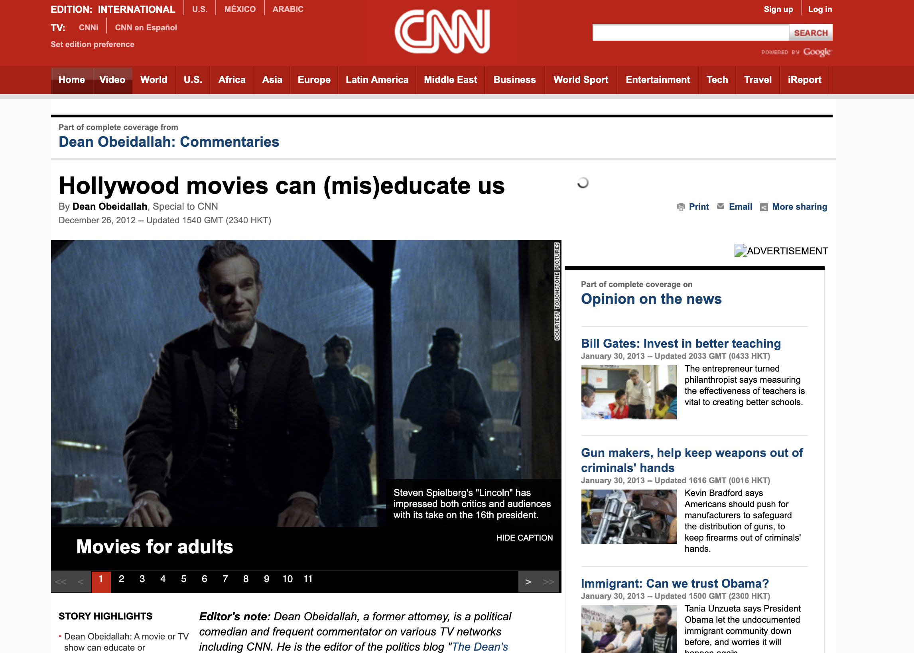

This project will explore the [CNN stories dataset](https://cs.nyu.edu/~kcho/DMQA/), originally used by DeepMind, that contains over 90,000 CNN web articles, and their respective HTML files, from April 2007 to April 2015. The data is semi-cleaned in that the main article and a brief summary has been extracted already from the HTML files into individual text files. However, for this project I want to extract the publish date for each article from the HTML files as well in order to plot a topic timeline that might provide insight on when certain topics are mostly likely to appear in the news. Furthermore, while the dataset includes a summary for each article, this data will only be used to verify the validity of the summaries generated from the model, especially since their origins are unknown. 

## Step 2: Preprocessing

- [x]  Tokenize all the text data
- [x]  Removing stopwords, numerical values, and non-English characters
- [x]  Lemmatizing based on part-of-speech
- [x]  Untokenize back together

As a result of preprocessing, the corpus of over 90,000 news articles reduced its token count from 811223 unique tokens to 192410, an over 75% decrease in dimensionality. 

## Step 3: Vectorization and Modeling

The next part was to use one of the many topic modeling techniques available to fit the data to. For this, I used CountVectorize and LatentDirichletAllocation functions from the sklean package. But before going on, let me explain why I used LDA (and consequently CountVectorize) for the modeling purposes.

There are plenty of other topic modeling methods out there, namely Non-Negative Matrix Factorization (NMF), Latent Semantic Analysis (LSA), and even variations of all of them like pLSA, lda2vec and malletlda. However, without going into the variants, from my research, LDA is widely considered the better option for most general topic modeling purposes. This is namely because it uses a dirichlet function (a kind of beta function) for the document-topic and word-topic distributions, lending itself to better generalization. Essentially, LDA gives a set of output probabilities and allows the topics and words themselves to vary. This plays nicely for our model as we can except words belonging to multiple topics and articles potentially belonging to multiple topics as well.

While there are other vectorization models, namely TFIDF and word2vec, that do more than just count the frequency of the word and consider other factors like part of speech, LDA takes a Bag-of-Words matrix as its input because the order of the word doesn't matter for its algorithm. CountVectorize is a Bag-of-Words vectorization model from sklearn that is needed to convert the text data in a sparse data matrix with the features being each unique word or token that appears in the corpus and the values being the count or frequency of each tokens appearance in each document or article.

Now that we know why we chose these models, lets do some parameter tuning. But what metrics should we look at for topic modeling with LDA? While there is no clear cut metric that is best for deciding the best model with LDA, a common tactic is to look at the coherence and perplexity scores. Topic Coherence score measures the degree of semantic similarity between high scoring words in the topic. Perplexity is the measure of how well a model predicts a sample. A lower perplexity implies data is more likely. As such, as the number of topics increase, the perplexity of the model should decrease. Generally you want to pick the number of topics based on the elbow of the perplexity scores while maintaining the highest coherence score. 

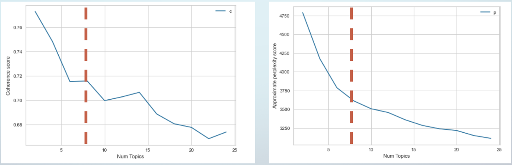

From the plots above, you can see 8 topics is the ideal candidate and was used going forward. We can interactively visualize the model using the pyLDAvis library as seen below (pictures of other topics can be seen in the Additional Materials section). Each topic appears to be evenly sized with good amount of separation using the 'tsne' setting. More importantly, we can clearly distinguish the topic of each grouping. The picture below is clearly grouping articles related to entertainment (movie, music, book, etc.) 

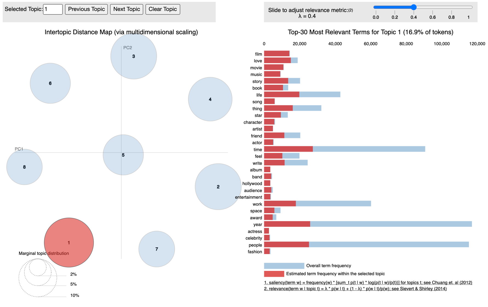

When labelled side by side to the actual articles (and despite clipping from the screenshots), the theme of the articles clearly fit dominant topic label for most of the rows. 

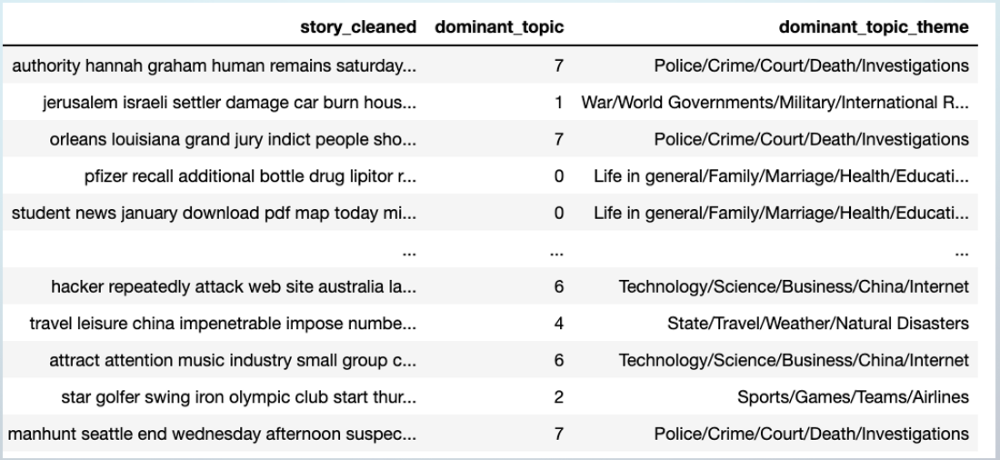

Additionally, the test data performed well comparatively to the training data. The perplexity only increased by ~10%, which would still be on the elbow of the original plot and in my opinion completely acceptable. This leads me to belief that the parameters in the vectorization and LDA model successfully selected the best words that correspond to the optimum number of topics.

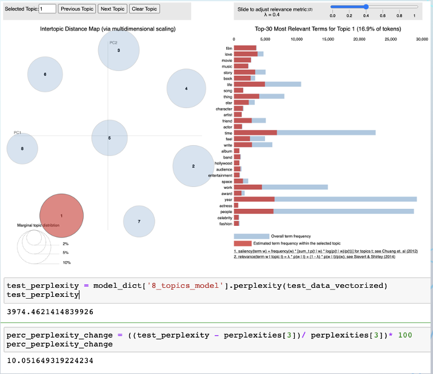

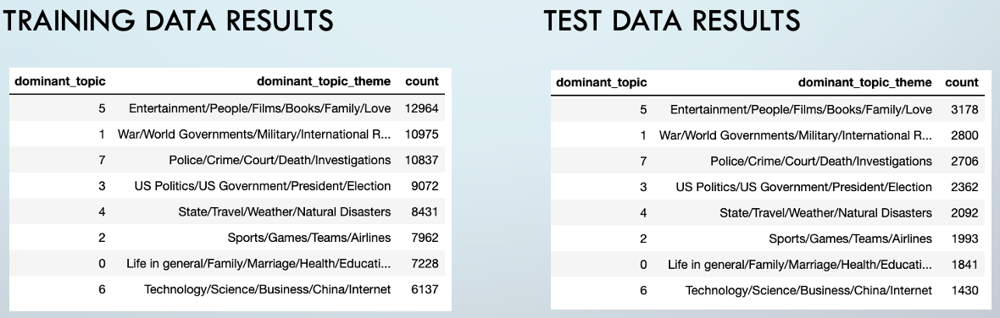

## Conclusion

Unfortunately, this is only the beginning for this project, as the model is far from applicable to the real world in its current state. The output vocabulary lists need to be cleaned and ranked by other metrics so that can be properly fitted into a current affairs curriculum on different levels (e.g. ranking the vocabulary difficult levels and account for synonyms). Furthermore, I want to explore if there are any trends when it comes to the published date of the articles. This could be a valuable tool for teachers to use as a way to predict when they should potentially go over a particular topic in the classroom. Also along this line, I would like to input a set of current news articles and see how it labels the articles. Namely, how does the U.S politics topic match Trump related articles to the trained Obama related articles. 

Ultimately, the end goal will be to produce an online textbook for ESL current affairs courses to utilize. But for this, I would need to access data via an API instead of a given dataset like the one used in this project. However, I still defend my initial choice to use the dataset over scrapping articles myself, as scrapping 90,000 articles in the time frame given would be terribly difficult to say the least. So, the next step in this project will be to find more current data, and implement a way to import streaming articles that can continuously update and improve upon the models used. 

## Additional Material

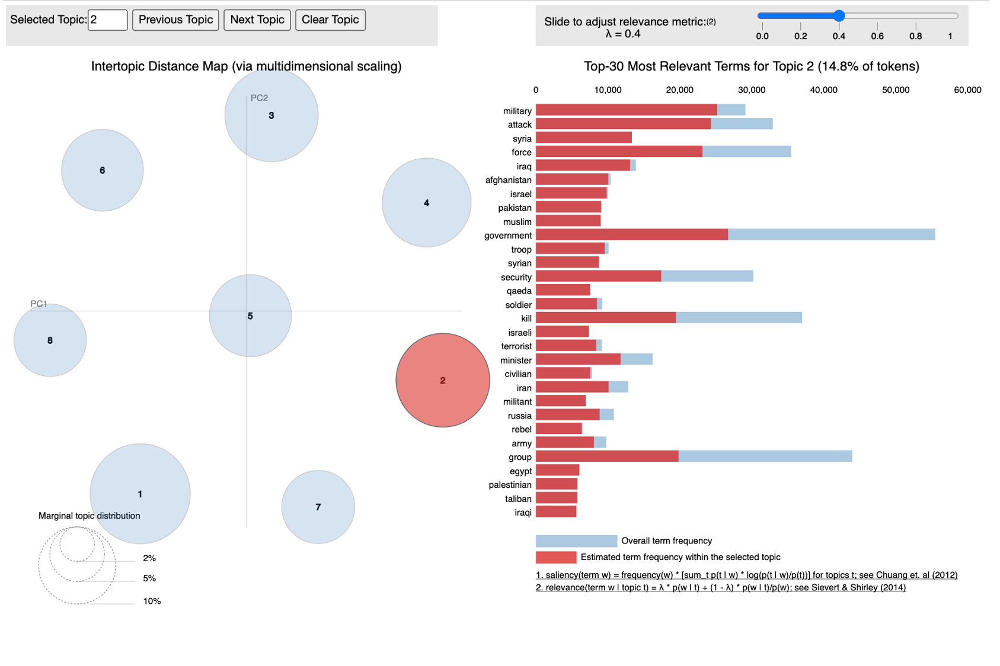
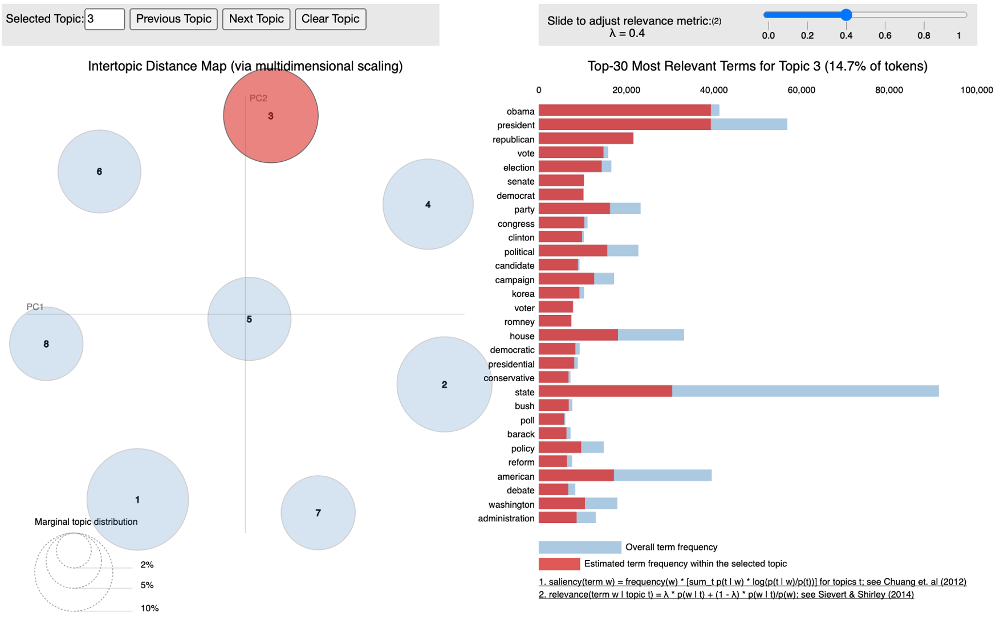
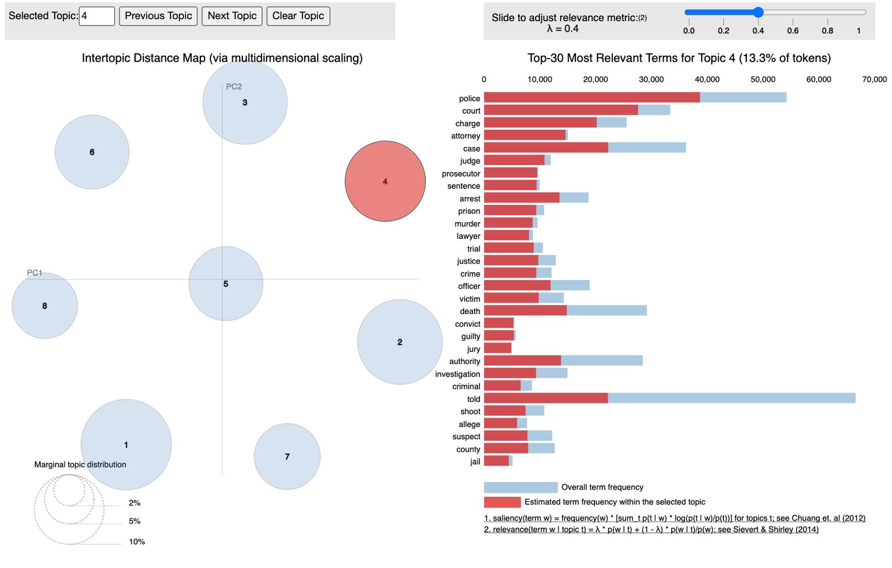
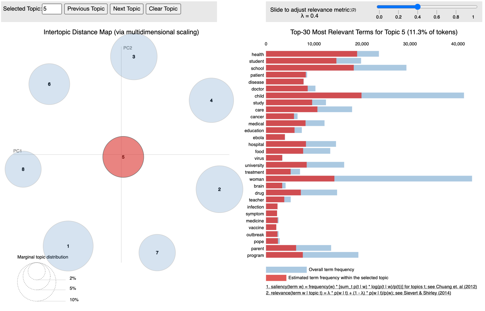
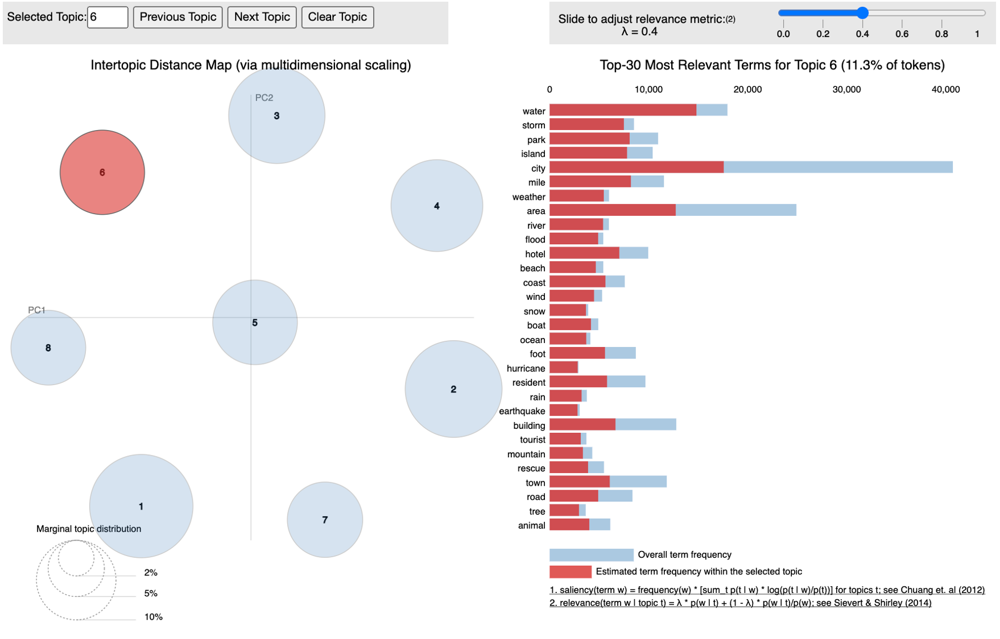
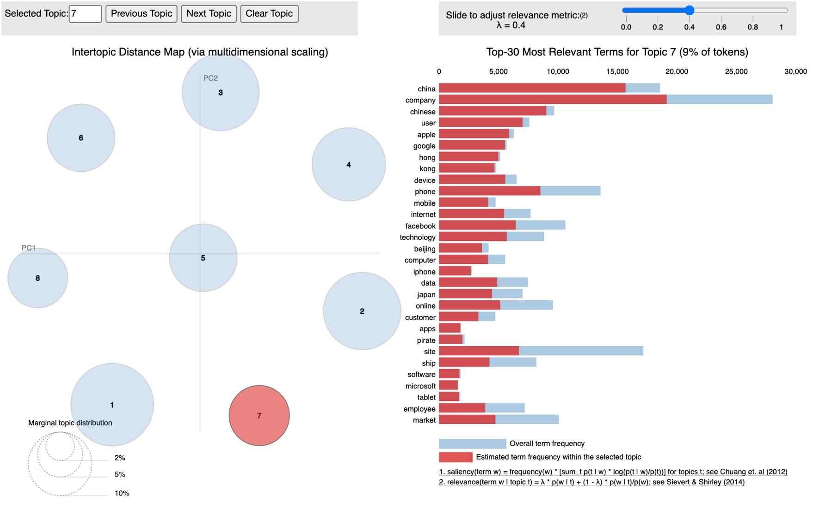
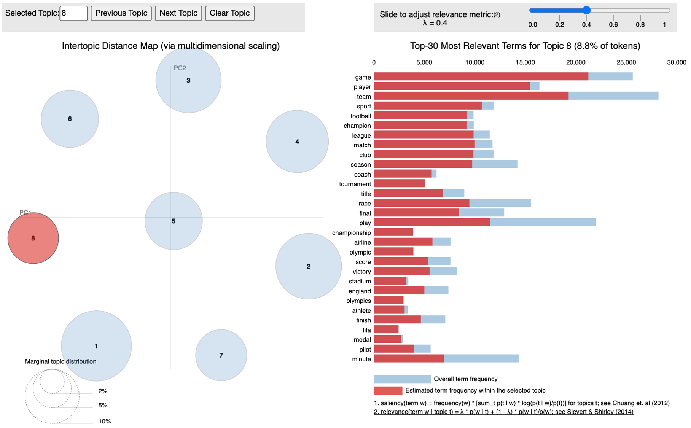
